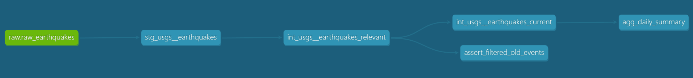

# USGS Earthquakes - dbt project

dbt project that transforms raw USGS earthquake data into a deduplicated,
analysis-ready dataset in BigQuery. Handles deduplication and incremental
merge for events that get revised by USGS after the fact (magnitude and
location updates can land days, sometimes weeks, after the original event).

## Scope

This project does not fetch any data. The `raw_earthquakes` source it reads
from is fed by a separate pipeline:
[usgs_pipeline](https://github.com/tomszy91/usgs_pipeline) (Python +
GitHub Actions, daily fetch from the USGS/FDSN API). That repo owns
ingestion only, this repo owns transformation only.

## Lineage

## Models

### staging

- **`stg_usgs__earthquakes`**: casts raw columns to their proper types.
  No business logic, fails loudly (`on_schema_change`-style casting) on a
  bad value rather than silently passing through.
- **`_src_earthquakes.yml`**: documents and tests the `raw.raw_earthquakes`
  source directly (`not_null`, `accepted_range` on magnitude/lat/lon/depth,
  `accepted_values` on status).

### intermediate

- **`int_usgs__earthquakes_relevant`**: the upstream pipeline fetches by
  `updatedafter`, which means it can resurface earthquakes from years ago
  if USGS happens to revise them. This model filters the dataset down to
  events that actually occurred after `var('project_start')`, so old,
  unrelated revisions don't pollute the analysis.
- **`int_usgs__earthquakes_current`**: incremental, `unique_key='event_id'`,
  `incremental_strategy='merge'`. Deduplicates by keeping, per `event_id`,
  the row with the highest `ingested_at`. The incremental filter avoids a
  raw subquery in the WHERE clause (BigQuery does not prune partitions on
  subqueries) by resolving the watermark once via `dbt_utils.get_single_value`
  and inlining it as a literal.

### marts

- **`agg_daily_summary`**: one row per day, built from
  `int_usgs__earthquakes_current`. Min/max magnitude, min/max depth, and a
  count per `status` (`automatic` / `reviewed` / `deleted`), plus a total.
  Tested with `dbt_utils.expression_is_true` to guarantee the three status
  counts always sum to the daily total.

## Tests

- Generic tests on most models and sources: `not_null`, `unique`,
  `accepted_range`, `accepted_values`.
- One singular test, **`assert_filtered_old_events`**: fails if any
  earthquake with `event_time` before `project_start` leaks through
  `int_usgs__earthquakes_relevant`, catching a regression in that filter
  directly instead of trusting it silently.

## CI/CD

Two GitHub Actions workflows, both install `dbt-core` + `dbt-bigquery`
(pinned versions), write BigQuery credentials from a base64 secret, and
run `dbt source freshness` before the actual build:

- **`dbt_build.yml`**: Monday-Saturday, 18:00 UTC, plus every push to
  `main` and manual dispatch. Runs `dbt build`.
- **`dbt_build_full_refresh.yml`**: Sunday, 18:00 UTC. Runs
  `dbt build --full-refresh`, rebuilding the incremental model from
  scratch once a week as a consistency check against silent drift.

## Macros

- **`generate_schema_name.sql`**: overrides dbt's default schema-naming
  behavior so everything stays in a single BigQuery dataset instead of
  getting a custom-schema suffix.

## Packages

- `dbt-labs/dbt_utils` 1.4.0
- `dbt-labs/codegen` 0.14.1

## Setup

1. `dbt deps`
2. Configure a `profiles.yml` target pointing at the same BigQuery
   project/dataset that `usgs_pipeline` writes to.
3. `dbt build`

## License

MIT, see [LICENSE](LICENSE).
